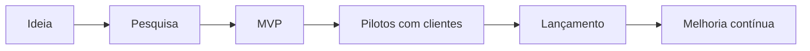
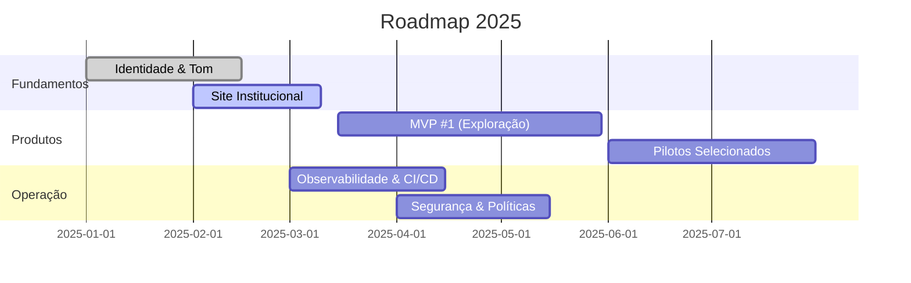

<div align="center">

# HyperSphere Studios

Construindo soluções digitais minimalistas, performáticas e sob medida.

[](#)
[](#)
[](#contato)
[](#stack)

</div>

## Sobre nós

Somos uma startup focada em transformar ideias em produtos digitais claros, rápidos e escaláveis. Acreditamos em um design minimalista, com alto contraste e acessibilidade, e em engenharia pragmática com automação desde o primeiro dia.

- Áreas: desenvolvimento web, automação/bots e consultoria técnica
- Cultura: simplicidade, performance, segurança by-default e iteração contínua
- Status: em construção — selecionando os primeiros parceiros e pilotos

## O que fazemos

- Aplicações web modernas (React/Next/Vite)
- Automação e bots (Discord/Telegram/integrações)
- Consultoria técnica (arquitetura, performance, DX)

## Tecnologias

- Front-end: React, Vite, Framer Motion, CSS moderno
- Back-end: Node.js/Express, integrações com APIs e bancos de dados
- Qualidade: ESlint/Prettier, CI, análise estática, testes

## Roadmap (alto nível)





## Como trabalhar conosco

- Precisa sair do zero ao MVP? Vamos co-desenhar o escopo mínimo viável.
- Quer modernizar um projeto existente? Fazemos diagnóstico e plano de ação incremental.
- Precisa de automação/bot? Definimos fluxo, integrações e governança.

> Foco em legibilidade, performance e manutenção. Entregas pequenas, frequentes e verificáveis.

## Contato

- E-mail: hello@hypersphere.dev
- Site: hypersphere.dev (em construção)
- Localização: Brasil (remoto)

---

<details>
<summary>Para mantenedores — ativar badges e extras avançados</summary>

Este README está pronto para o perfil da organização. Para publicá-lo:

1) Crie um repositório público chamado `.github` na organização
2) Dentro dele, crie `profile/README.md` (este arquivo)

Badges dinâmicos (opcionais):

- CI status: substitua `owner/repo` abaixo pelo seu repositório

```
[](https://github.com/owner/repo/actions/workflows/ci.yml)
```

- Qualidade de código (ESLint/Tests): adicione workflows em `.github/workflows/*.yml` e badges equivalentes
- Versão/Release: use GitHub Releases e um badge tipo `shields.io/github/v/release/owner/repo`

Outros recursos recomendados:

- `.github/CODEOWNERS` — donos de código por pasta
- `SECURITY.md` — política de segurança e reporte de vulnerabilidades
- `CONTRIBUTING.md` — guia de contribuição (PRs, padrão de commits, convenções)
- `FUNDING.yml` — opções de apoio/financiamento (quando aplicável)
- `ISSUE_TEMPLATE/` e `PULL_REQUEST_TEMPLATE.md` — fluxos consistentes

</details>
